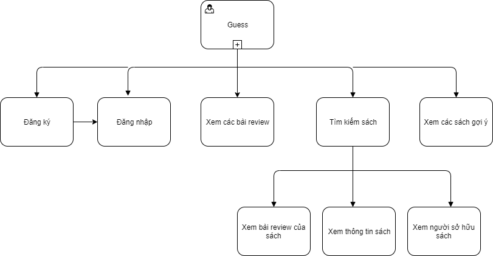

# WanahBook - An Book Exchange Social Network

## I. Tổng quan

**WanahBook** là một nền tảng kết nối những người đọc sách, cho phép người dùng mượn và chia sẻ thông tin về sách. 
##### Cơ chế trao đổi sách
+ Người có sách muốn trao đổi tại website, viết review về quyển sách
+ Nếu có người mượn sách thì bắt đầu trao đổi trực tiếp với nhau qua tin nhắn về thời gian, địa điểm, … để mượn sách.

## II. Giải quyết vấn đề

Mỗi tháng mọi người đều dành một khoản từ 200.000-500.000 nghìn đồng để mua sách. Đọc lần đầu sách vẫn còn mới và đọc thì lần đầu thường kiểu cưỡi ngựa xem hoa, vẫn nên lưu lại để đọc lại ,mà số lần đọc lại cực kỳ hiếm, chưa kể có những cuốn sách mua về nhưng không đọc. Như vậy sẽ rất lãng phí.

Bên cạnh đó, có rất nhiều người muốn đọc sách nhưng họ không đủ tiền để mua quyển sách đó, đa phần họ là sinh viên các trường đại học, cao đẳng. Việc được đọc cuốn sách mà không cần bỏ ra nhiều tiền để mua chúng rất là tuyệt vời, tạo điều kiện cho sinh viên trau dồi tri thức, là động lực giúp họ đạt được ước mơ một cách chân thực hơn.

Chính vì thế, việc trao đổi sách sẽ giúp mọi người chia sẻ giá trị, kiến thức mà còn tiết kiệm thêm một khoản nhỏ để dành cho bạn vào những chi tiêu khác, tạo điều kiện cho tất cả mọi người đều được đọc sách.

## III. Mô tả chức năng 

**WanahBook** bao gồm các chức năng chính sau:

<table>
  <tr>
    <th>STT</th>
    <th>Mã chức năng</th>
    <th>Tên chức năng</th>
    <th>Phân loại chức năng</th>
    <th>Actor</th>
    <th>Mô tả</th>
  </tr>
  <tr>
    <td>1</td>
    <td>RES</td>
    <td>Đăng ký</td>
    <td>Account</td>
    <td>Guest</td>
    <td>Đăng ký tài khoản để đăng nhập vào hệ thống có thể đăng ký bằng gmail, facebook.</td>
  </tr>
  <tr>
    <td>2</td>
    <td>LOG</td>
    <td>Đăng nhập</td>
    <td>Account</td>
    <td>Guest</td>
    <td>Nhập tài khoản và mật khẩu để đăng nhập vào hệ thống.</td>
  </tr>
  <tr>
    <td>3</td>
    <td>CREV</td>
    <td>Tạo bài review</td>
    <td>Review</td>
    <td>User</td>
    <td>Tạo một bài review về cuốn sách ưa thích. Bài review sẽ hiện thị lên trang cá nhân của người viết</td>
  </tr>
  <tr>
    <td>4</td>
    <td>SREV</td>
    <td>Xem các bài review</td>
    <td>Review</td>
    <td>User, Guess</td>
    <td>Người dùng có thể tìm hiểu sách qua bài review về sách của người dùng khác.</td>
  </tr>
  <tr>
    <td>5</td>
    <td>EREV</td>
    <td>Đánh giá bài review</td>
    <td>Review</td>
    <td>User</td>
    <td>Bình luận, đánh giá sao cho các bài review.</td>
  </tr>
  <tr>
    <td>6</td>
    <td>CBOOK</td>
    <td>Thêm tủ sách</td>
    <td>Book</td>
    <td>User</td>
    <td>Thêm sách mà người dùng sở hữu.</td>
  </tr>
  <tr>
    <td>7</td>
    <td>BBOOK</td>
    <td>Mượn sách</td>
    <td>Book</td>
    <td>User</td>
    <td>Tạo một yêu cầu mượn cuốn sách mà người dùng khác sở hữu.</td>
  </tr>
  <tr>
    <td>8</td>
    <td>SBOOK</td>
    <td>Xem thông tin sách</td>
    <td>Book</td>
    <td>Guess, User</td>
    <td>Xem thông tin chi tiết của một cuốn sách như tác giả, nội dung chính, nhà xuất bản, những người sở hữu, ...</td>
  </tr>
  <tr>
    <td>9</td>
    <td>MES</td>
    <td>Nhắn tin </td>
    <td>User</td>
    <td>User</td>
    <td>2 người có thể nhắn tin trao đổi về thời gian, địa điểm mượn sách hay chém gió về các cuốn sách hay,...</td>
  </tr>
  <tr>
    <td>10</td>
    <td>SUSER</td>
    <td>Xem thông tin người dùng</td>
    <td>User</td>
    <td>User</td>
    <td>Xem thông tin, các bài review, sách hiện có của người khác.</td>
  </tr>
  <tr>
    <td>11</td>
    <td>UBOR</td>
    <td>Cập nhật trạng thái mượn sách</td>
    <td>Book</td>
    <td>User</td>
    <td>Khi có người mượn sách, người dùng có thể thay đổi trạng thái mượn. Có các trạng thái như đợi mượn, đã mượn, đã trả. </td>
  </tr>
  <tr>
    <td>12</td>
    <td>NTF</td>
    <td>Thông báo</td>
    <td>User</td>
    <td>System</td>
    <td>Hệ thống sẽ thông báo cho người dùng khi có người mượn sách, đến hạn trả sách,...</td>
  </tr>
  <tr>
    <td>13</td>
    <td>BOSE</td>
    <td>Tìm kiếm sách</td>
    <td>Book</td>
    <td>User, Guess</td>
    <td>Người dùng tìm kiếm sách.</td>
  </tr>
  <tr>
    <td>14</td>
    <td>USE</td>
    <td>TÌm kiếm người dùng</td>
    <td>Account</td>
    <td>User</td>
    <td>Người dùng tìm kiếm thông tin người dùng khác.</td>
  </tr>
  <tr>
    <td>15</td>
    <td>SERV</td>
    <td>Xem review mới nhất</td>
    <td>Review</td>
    <td>User</td>
    <td>Người dùng xem các bài review mới được đăng lên nhất.</td>
  </tr>
  <tr>
    <td>16</td>
    <td>BSUG</td>
    <td>Gợi ý sách</td>
    <td>Book</td>
    <td>Guess, User</td>
    <td>Hệ thống hiện thị những adnh sách những sách được mượn nhiều,  sách hay, sách ở gần. </td>
  </tr>
  <tr>
    <td>17</td>
    <td>ACC</td>
    <td>Xem trang cá nhân</td>
    <td>Account</td>
    <td>User</td>
    <td>Người dùng xem thông tin cá nhân.</td>
  </tr>
  <tr>
    <td>18</td>
    <td>NOTI</td>
    <td>Xem thông báo</td>
    <td>System</td>
    <td>User</td>
    <td>Người dùng xem thông báo yêu cầu mượn sách hoặc thông báo thời gian trả, mượn sách.</td>
  </tr>
  <tr>
    <td>19</td>
    <td>REB</td>
    <td>Xem bài review của sách</td>
    <td>Review</td>
    <td>User, Guess</td>
    <td>Người dùng xem các bài review của cuốn sách đó.</td>
  </tr>
  <tr>
    <td>20</td>
    <td>SEU</td>
    <td>Xem ngừơi sở hữu sách</td>
    <td>User</td>
    <td>User</td>
    <td>Người dùng xem thông tin tài khoản những người sở hữu cuốn sách đó.</td>
  </tr>
  <tr>
    <td>21</td>
    <td>BOK</td>
    <td>Sách tương tự</td>
    <td>Book</td>
    <td>User</td>
    <td>Người dùng xem danh sách những cuốn sách cùng thể loại hoặc cùng tác giả..</td>
  </tr>
  <tr>
    <td>22</td>
    <td>BOKC</td>
    <td>Xem tủ sách của người dùng</td>
    <td>Book</td>
    <td>User</td>
    <td>Người dùng xem tủ sách của người dùng khác.</td>
  </tr>
  <tr>
    <td>23</td>
    <td>REVU</td>
    <td>Xem review của người dùng</td>
    <td>Review</td>
    <td>User</td>
    <td>Người dùng xem các bài review của người dùng khác.</td>
  </tr>
  <tr>
    <td>24</td>
    <td>COMT</td>
    <td>Bình luận</td>
    <td>User</td>
    <td>User</td>
    <td>Người dùng bình luận trong các bài review.</td>
  </tr>
  <tr>
    <td>25</td>
    <td>MAB</td>
    <td>Quản lý tủ sách của mình</td>
    <td>Book</td>
    <td>User</td>
    <td>Người dùng quản lý tủ sách của mình.</td>
  </tr>
  <tr>
    <td>26</td>
    <td>MAR</td>
    <td>Quản lý review của mình</td>
    <td>Review</td>
    <td>User</td>
    <td>Người dùng quản lý các bài review của mình.</td>
  </tr>
  <tr>
    <td>27</td>
    <td>SEEN</td>
    <td>Xem trạng thái mượn sách</td>
    <td>Book</td>
    <td>User</td>
    <td>Người dùng xem trạng thái mượn sách của mình.</td>
  </tr>
  <tr>
    <td>28</td>
    <td>UPIF</td>
    <td>Cập nhập thông tin cá nhân</td>
    <td>Account</td>
    <td>User</td>
    <td>Người dùng chỉnh sửa thay đổi thông tin cá nhân.</td>
  </tr>
  <tr>
    <td>29</td>
    <td>MAU</td>
    <td>Quản lý người dùng</td>
    <td>Account</td>
    <td>Admin</td>
    <td>Admin quản lý thông tin tài khoản người dùng.</td>
  </tr>
  <tr>
    <td>30</td>
    <td>NOTU</td>
    <td>Thông báo người dùng</td>
    <td>Account</td>
    <td>Admin</td>
    <td>Admin thông báo đến cho người dùng hạn trả sách và những yêu caais mượn sách.</td>
  </tr>
  <tr>
    <td>31</td>
    <td>MABO</td>
    <td>Quản lý sách</td>
    <td>Book</td>
    <td>Admin</td>
    <td>Admin quản lý hệ thống sách.</td>
  </tr>
  <tr>
    <td>32</td>
    <td>MACA</td>
    <td>Quản lý thể loại sách</td>
    <td>Book</td>
    <td>Admin</td>
    <td>Admin quản lý thể loại sách.</td>
  </tr>
  <tr>
    <td>33</td>
    <td>MANXB</td>
    <td>Quản lý NXB</td>
    <td>Book </td>
    <td>Admin</td>
    <td>Admin quản lý NXB của từng cuốn sách.</td>
  </tr>
  <tr>
    <td>34</td>
    <td>MARE</td>
    <td>Quản lý review</td>
    <td>Review</td>
    <td>Admin</td>
    <td>Admin quản lý các bài review.</td>
  </tr>
  <tr>
    <td>35</td>
    <td>SMES</td>
    <td>Xem tin nhắn</td>
    <td>User</td>
    <td>User</td>
    <td>Người dùng xem lại các tin nhắn của mình.</td>
  </tr>
  <tr>
    <td>35</td>
    <td>USAR</td>
    <td>Xem user được gợi ý</td>
    <td>User</td>
    <td>User</td>
    <td>Gợi ý các user tích cực, xung quanh bạn</td>
  </tr>
</table>

## IV. Actor 
Phần mềm gồm có 3 actor chính là  

<table class="tg">
  <tr>
    <th>STT</th>
    <th>Actor</th>
    <th>Mô tả</th>
  </tr>
  <tr>
    <td>1</td>
    <td>Guest</td>
    <td>Người dùng khi chưa đăng nhập vào hệ thống hoặc sau khi đăng xuất khỏi hệ thống</td>
  </tr>
  <tr>
    <td>2</td>
    <td>Admin</td>
    <td>Người dùng với quyền quản trị hệ thống</td>
  </tr>
    <tr>
    <td>3</td>
    <td>User</td>
    <td>Người dùng sau khi đã đăng nhập vào hệ thống</td>
  </tr>
</table>

## V. Page Demo

Hình 1: Trang đăng ký tài khoản

Hình 2: Trang đăng nhập

Hình 3: Trang Admin

Hình 4: Trang chủ

Hình 5: Trang gợi ý sách

Hình 6: Trang xem thông tin sách

Hình 7: Trang cập nhật thông tin cá nhân

Hình 8: Trang cá nhân

Hình 9: Trang xem review

Hình 10: Trang xem thông tin user

Hình 11: Trang xem các user được gợi ý

**WanahBook** bao gồm các trang có chức năng sau:

<table>
  <tr>
    <th>STT</th>
    <th>Tên trang</th>
    <th>Chức năng</th>
  </tr>
  <tr>
    <td>1</td>
    <td>Trang đăng ký tài khoản</td>
    <td>RES</td>
  </tr>
  <tr>
    <td>2</td>
    <td>Trang đăng nhập tài khoản</td>
    <td>LOG </td>
  </tr>
  <tr>
    <td>3</td>
    <td>Trang Admin</td>
    <td> User: MAU, NOTU; Book: MABO, MACA, MANXB; Review: MARE.  </td>
  </tr>
  <tr>
    <td>4</td>
    <td>Trang chủ</td>
    <td>BOSE, USE, SREV, BSUG, ACC</td>
  </tr>
  <tr>
    <td>5</td>
    <td>Trang gợi ý sách</td>
    <td>BSUG</td>
  </tr>
  <tr>
    <td>6</td>
    <td>Trang xem thông tin sách</td>
    <td>SBOOK, BBOOK, CBOOK, REB, SEU, BOK</td>
  </tr>
  <tr>
    <td>7</td>
    <td>Trang cập nhật thông tin cá nhân</td>
    <td>UPIF</td>
  </tr>
  <tr>
    <td>8</td>
    <td>Trang cá nhân</td>
    <td>ACC, MAB, MAR, NOTI</td>
  </tr>
  <tr>
    <td>9</td>
    <td>Trang xem review</td>
    <td>SREV, CREV</td>
  </tr>
  <tr>
    <td>10</td>
    <td> Trang xem thông tin user</td>
    <td>BOKC, REVU</td>
  </tr>
  <tr>
    <td>11</td>
    <td> Trang xem các user được gợi ý</td>
    <td>USAR</td>
  </tr>
</table>

## VI. Business Process 

